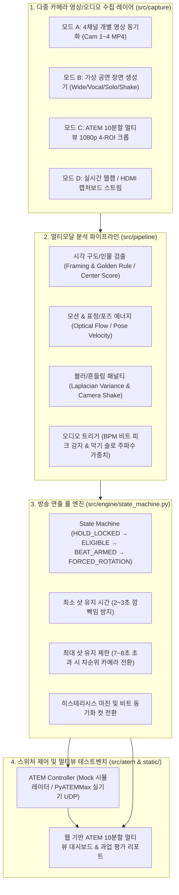

# ATEM Mini Pro 기반 AI 방송 디렉터 에이전트 구조 및 다중 카메라 선택 테스트벤치 구현 계획

## 1. 개요 (Goal Description)

첨부된 **ATEM Mini Pro 멀티뷰 및 AI 방송 자동화(Automated Broadcast / AI Director) 아키텍처 자료**를 바탕으로 다음 두 가지 핵심 목표를 달성합니다.

1. **에이전트 주도 개발 및 운영을 위한 표준 구조 구축 (`AGENTS.md`, `.agents/rules/`, `.agents/skills/`, `specs/`)**
   - Antigravity 커스터마이제이션 표준에 맞춘 프로젝트 루트 규칙(`AGENTS.md`), 세부 도메인 규칙(`.agents/rules/*.md`), 단계별 실행 런북 스킬(`.agents/skills/*/SKILL.md`), 그리고 5종의 기술 명세서(`specs/00~04`)를 작성하여 에이전트와 개발자가 일관된 방송 자동화 파이프라인을 확장·유지보수할 수 있게 합니다.
2. **동일 장면 다중 카메라 선택 과업(Scene Camera Selection Task) 통합 테스트벤치 구현**
   - 동일 장면(음악 공연 등)을 촬영한 여러 대의 카메라 영상을 실시간 분석하여 **가장 좋은 화면(Best Shot)**을 판별하고 ATEM 스위처(Mock/실기기)로 전환 신호를 보내는 **Python 백엔드 엔진 + 웹 기반 ATEM 10분할 멀티뷰 대시보드**를 구축합니다.
   - 선택해주신 4가지 입력/시뮬레이션 모드(**① 4개 개별 카메라 동기화 재생**, **② 가상 다중 카메라 공연 장면 자동 생성기**, **③ ATEM 10분할 멀티뷰 단일 영상 크롭**, **④ 실시간 웹캠/캡처보드 및 ATEM 제어 연동**)를 모두 지원합니다.

---

## 2. 시스템 아키텍처 다이어그램



---

## 3. 제안 변경 사항 (Proposed Changes)

### Component 1: Antigravity 에이전트 규칙 및 거버넌스 (`AGENTS.md` & `.agents/rules/`)

프로젝트 전반의 아키텍처 원칙, 코딩 컨벤션, 실시간 프레임 처리 제약 조건을 정의합니다.

#### [NEW] [AGENTS.md](file:///c:/Users/ddosu/antigravity_workspace/first/AGENTS.md)
- 프로젝트 개요, 디렉토리 구조, 핵심 실행 명령어(`python scripts/generate_synthetic_scene.py`, `uvicorn src.server.app:app`), 모듈 간 의존성 경계 정의.
- **절대 원칙**: (1) 시각 분석 루프의 프레임 처리 지연 시간은 33ms(30fps 기준) 이하 유지, (2) 룰 엔진을 거치지 않은 직접 카메라 전환 호출 금지, (3) 실제 ATEM 장비 미연결 시 자동으로 `MockATEMAdapter`로 폴백(Fallback).

#### [NEW] [.agents/rules/vision-and-audio-scoring.md](file:///c:/Users/ddosu/antigravity_workspace/first/.agents/rules/vision-and-audio-scoring.md)
- 모든 카메라 세부 점수($F_i$: 구도/인물, $M_i$: 모션 에너지, $S_i$: 선명도, $A_i$: 오디오 가중치)를 `[0.0, 1.0]` 범위로 정규화하는 수학적 규칙과 블러 제외 임계값(`laplacian_threshold`) 취급 규칙 명시.

#### [NEW] [.agents/rules/broadcast-state-machine.md](file:///c:/Users/ddosu/antigravity_workspace/first/.agents/rules/broadcast-state-machine.md)
- 방송 연출 휴리스틱 불변식(Invariant): 최소 유지 시간(`min_hold_sec = 2.5s`), 최대 유지 시간(`max_hold_sec = 7.5s`), 히스테리시스 마진(`switch_margin = 0.12`), 긴급 예외 전환(현재 Program 카메라에 심각한 블러/이탈 발생 시 조기 탈출) 규칙 정의.

---

### Component 2: Antigravity 전용 스킬 패키지 (`.agents/skills/`)

작업 목적에 따라 에이전트가 온디맨드로 로드하여 활용할 수 있는 4개의 전문 스킬을 구성합니다.

#### [NEW] [.agents/skills/multiview-vision-scorer/SKILL.md](file:///c:/Users/ddosu/antigravity_workspace/first/.agents/skills/multiview-vision-scorer/SKILL.md)
- ATEM Mini Pro 10분할 멀티뷰 레이아웃의 1080p 좌표계에서 Cam 1~4 영역을 정밀 크롭(Crop)하는 방법, 구도(골든 룰/헤드룸)·모션·라플라시안 선명도 가중치 튜닝 절차 수록.
- 보조 레퍼런스: [.agents/skills/multiview-vision-scorer/references/multiview_layout_1080p.md](file:///c:/Users/ddosu/antigravity_workspace/first/.agents/skills/multiview-vision-scorer/references/multiview_layout_1080p.md)

#### [NEW] [.agents/skills/direction-rule-engine/SKILL.md](file:///c:/Users/ddosu/antigravity_workspace/first/.agents/skills/direction-rule-engine/SKILL.md)
- 방송 연출 State Machine 파라미터 튜닝, 오디오 BPM 비트 피크와 컷 전환 타이밍 동기화, 악기 솔로 구간 가중치 부스트 설정 가이드.

#### [NEW] [.agents/skills/atem-switcher-control/SKILL.md](file:///c:/Users/ddosu/antigravity_workspace/first/.agents/skills/atem-switcher-control/SKILL.md)
- `PyATEMMax` 소켓 제어, `atem-connection` / Bitfocus Companion HTTP 웹훅 연동 및 하드웨어 없이 동작하는 `MockATEMAdapter` 검증 절차.

#### [NEW] [.agents/skills/multicam-testbench/SKILL.md](file:///c:/Users/ddosu/antigravity_workspace/first/.agents/skills/multicam-testbench/SKILL.md)
- 다중 카메라 선택 과업(Scene Selection Task) 시나리오 생성, 벤치마크 스크립트 실행, 정답(Ground Truth) 연출 타임라인 대비 AI 디렉터의 일치율·안정성 지표를 평가하는 절차.

---

### Component 3: 시스템 상세 명세서 (`specs/`)

구현 전·후 기준점이 되는 5개의 체계적인 마크다운 기술 명세서를 작성합니다.

#### [NEW] [specs/00-system-architecture.md](file:///c:/Users/ddosu/antigravity_workspace/first/specs/00-system-architecture.md)
- 전체 3단계 파이프라인(영상 캡처 → CV/Audio 멀티모달 스코어링 → 연출 룰 엔진 & ATEM 제어) 아키텍처 및 데이터 스키마 명세.

#### [NEW] [specs/01-capture-and-multiview-spec.md](file:///c:/Users/ddosu/antigravity_workspace/first/specs/01-capture-and-multiview-spec.md)
- ATEM Mini Pro의 하드웨어 병목(USB-C 단일 Program 출력 한계) 해결을 위한 **HDMI OUT 멀티뷰 캡처 + OpenCV 4분할 크롭 좌표 규격** 및 4채널 파일/스트림 프레임 동기화 규격.

#### [NEW] [specs/02-multimodal-scoring-spec.md](file:///c:/Users/ddosu/antigravity_workspace/first/specs/02-multimodal-scoring-spec.md)
- 카메라 $i$의 시각·청각 통합 점수 산출 수식 명세:
  $$S_i(t) = \mathbb{I}(\text{Blur}_i(t) \ge \tau_{\text{sharp}}) \cdot \left( w_{\text{frame}} F_i(t) + w_{\text{motion}} M_i(t) + w_{\text{gaze}} G_i(t) + w_{\text{audio}} A_i(t) \right)$$

#### [NEW] [specs/03-broadcast-state-machine-spec.md](file:///c:/Users/ddosu/antigravity_workspace/first/specs/03-broadcast-state-machine-spec.md)
- 0.5초 단위 화면 깜빡임을 방지하는 유한 상태 기계(FSM) 상태 전이표, 최소 유지 타이머(2~3초), 최대 유지 강제 전환(7~8초), 비트 스냅(Beat-Snap) 윈도우 명세.

#### [NEW] [specs/04-testbench-evaluation-spec.md](file:///c:/Users/ddosu/antigravity_workspace/first/specs/04-testbench-evaluation-spec.md)
- 동일 장면 다중 카메라 선택 테스트 과업의 평가 프로토콜:
  - **GT 일치율 (Scene Selection Accuracy)**: 의도된 최우선 카메라(보컬 파트, 기타 솔로, 와이드 샷 등)와 일치하는 시간 비율
  - **블러 회피율 (Blur Avoidance Rate)**: 흔들림/포커스 아웃 구간이 Program에 송출되지 않은 비율
  - **평균 샷 지속 시간 & 안정성 (Shot Stability)**

---

### Component 4: Python 멀티모달 분석 엔진 & 백엔드 서버 (`src/` & `scripts/`)

#### [NEW] [requirements.txt](file:///c:/Users/ddosu/antigravity_workspace/first/requirements.txt)
- `fastapi`, `uvicorn[standard]`, `opencv-python`, `numpy`, `scipy`, `pydantic`, `websockets`, `pytest` (선택적 `PyATEMMax` 지원 포함).

#### [NEW] [scripts/generate_synthetic_scene.py](file:///c:/Users/ddosu/antigravity_workspace/first/scripts/generate_synthetic_scene.py)
- 외부 영상 파일이 없어도 즉시 테스트할 수 있도록 **동일한 음악 공연 장면(30초, 30fps)**을 4개의 카메라 앵글로 동시 렌더링하여 `data/synthetic/` 폴더에 생성합니다:
  - `cam1_wide.mp4`: 전체 무대 풀샷 (안정적인 기본 점수)
  - `cam2_vocal.mp4`: 보컬 클로즈업 (전반부·후반부 정면 응시 및 높은 구도 점수, 일부 구간 프레이밍 이탈)
  - `cam3_guitar_solo.mp4`: 기타리스트 앵글 (10초~18초 구간 강렬한 연주 모션 에너지 + 오디오 고주파 솔로 피크 발생)
  - `cam4_roaming.mp4`: 역동적 무빙캠 (높은 구도 점수를 가지나 14초~17초 및 22초~25초에 의도적인 카메라 흔들림/가우시안 블러 발생 → 제외 테스트용)
  - `multiview_10split.mp4`: 위 4개 카메라와 Program/Preview/오디오 미터를 실제 ATEM Mini Pro 10분할 레이아웃으로 합성한 1080p 멀티뷰 테스트 영상
  - `scene_metadata.json`: 오디오 비트 타임스탬프(120 BPM), 솔로 구간 정보, 구간별 Ground Truth 최적 카메라 레이블

#### [NEW] [src/capture/ingestor.py](file:///c:/Users/ddosu/antigravity_workspace/first/src/capture/ingestor.py)
- 4가지 입력 모드(`synthetic`, `quad_files`, `multiview_crop`, `live_webcam`)를 동일한 4채널 프레임 묶음(`Dict[int, np.ndarray]`)으로 추상화하여 반환하는 멀티소스 인제스터.

#### [NEW] [src/pipeline/vision_scorer.py](file:///c:/Users/ddosu/antigravity_workspace/first/src/pipeline/vision_scorer.py)
- OpenCV 기반 4채널 병렬 분석기:
  1. **인물/피사체 구도 점수 ($F_i$)**: 중심부 골든 룰/헤드룸 영역 내 피사체 점유율 및 가장자리 잘림(Edge Clipping) 감점 계산.
  2. **모션/연주 에너지 ($M_i$)**: 프레임 간 밀집 광류(Optical Flow / 프레임 차분) 및 상체/손 영역 움직임 에너지 측정.
  3. **블러/흔들림 감지 ($\text{Sharpness}_i$)**: `cv2.Laplacian(gray, cv2.CV_64F).var()` 계산 및 글로벌 모션 흔들림 감지. 기준치 미달 시 `is_blurry = True` 플래그 설정 및 후보 제외.

#### [NEW] [src/pipeline/audio_analyzer.py](file:///c:/Users/ddosu/antigravity_workspace/first/src/pipeline/audio_analyzer.py)
- 오디오 파형(WAV 또는 합성 스트림)에서 드럼 킥/스네어 비트 피크(`is_beat_peak`)와 악기 솔로 대역 에너지 급증을 감지하여 해당 악기 전담 카메라(예: Cam 3)에 가중치 보너스를 부여.

#### [NEW] [src/engine/state_machine.py](file:///c:/Users/ddosu/antigravity_workspace/first/src/engine/state_machine.py)
- 방송 연출 룰 엔진 구현:
  - 현재 Program 카메라 유지 시간(`current_shot_duration`) 추적
  - `min_hold_sec` (기본 2.5초) 미경과 시 전환 차단 (단, 현재 카메라가 심각한 블러 상태면 즉시 비상 전환)
  - `max_hold_sec` (기본 7.5초) 초과 시 현재 카메라를 제외한 차순위 최고 점수 카메라로 강제 전환
  - 비트 동기화 모드 활성화 시 가장 가까운 비트 피크 타이밍에 컷(Cut) 또는 믹스(Mix) 트리거

#### [NEW] [src/atem/controller.py](file:///c:/Users/ddosu/antigravity_workspace/first/src/atem/controller.py)
- `MockATEMSwitcher` (메모리 상태, 탈리 라이트, 명령 로그 기록) 및 `PyATEMMaxSwitcher` (실제 ATEM IP 연결 시 `setProgramInputVideoSource` 및 `execCutME` 호출) 어댑터 제공.

#### [NEW] [src/server/app.py](file:///c:/Users/ddosu/antigravity_workspace/first/src/server/app.py)
- FastAPI REST & WebSocket 서버:
  - 실시간 4채널 크롭/분석 화면 및 멀티뷰 스트림 전송
  - 가중치(`w_framing`, `w_motion`, `w_audio`, `blur_threshold`) 및 룰 엔진 파라미터(`min_hold`, `max_hold`) 실시간 조작 API
  - 자동 벤치마크 실행(`POST /api/benchmark/run`) 및 Ground Truth 비교 리포트 반환

---

### Component 5: 웹 기반 ATEM 10분할 멀티뷰 & 카메라 선택 테스트벤치 (`static/`)

#### [NEW] [static/index.html](file:///c:/Users/ddosu/antigravity_workspace/first/static/index.html), [static/styles.css](file:///c:/Users/ddosu/antigravity_workspace/first/static/styles.css), [static/app.js](file:///c:/Users/ddosu/antigravity_workspace/first/static/app.js)
- **ATEM Mini Pro 하드웨어 멀티뷰 화면 구성 완벽 재현**:
  - 상단 좌측 **Preview (대기 화면 - 초록 보더)** / 상단 우측 **Program (최종 송출 화면 - 빨강 탈리 보더)**
  - 중단 **Cam 1 ~ Cam 4 실시간 분석 뷰**: 피사체 가이드라인(골든 룰 그리드), 구도/모션/선명도 실시간 게이지, 블러 경고 배지(`BLUR EXCLUDED`), 솔로 부스트 배지(`SOLO BOOST`) 오버레이
  - 하단 **ATEM Software Control 스타일 스위처 데크 & 룰 엔진 인스펙터**:
    - 입력 소스 선택 탭 (`가상 공연 시나리오`, `4채널 개별 영상 업로드/로드`, `ATEM 10분할 멀티뷰 크롭 모드`, `실시간 웹캠/캡처보드`)
    - 수동/자동(AI Director) 전환 토글, Cut / Auto(Mix) 버튼, 최소/최대 유지 시간 슬라이더
    - **과업 테스트 결과 패널**: 타임라인 상의 AI 선택 vs. 추천(Ground Truth) 카메라 비교 차트, 정답 일치율(%), 블러 회피 성공률(%), 평균 컷 유지 시간 통계 표시

---

## 4. 검증 계획 (Verification Plan)

### Automated Tests
1. **가상 다중 카메라 테스트 데이터셋 생성 검증**:
   ```powershell
   python scripts/generate_synthetic_scene.py
   ```
   - `data/synthetic/` 내에 `cam1_wide.mp4` ~ `cam4_roaming.mp4`, `multiview_10split.mp4`, `scene_metadata.json`이 정상 생성되는지 확인합니다.
2. **파이프라인 및 연출 룰 엔진 단위/통합 테스트 (`pytest`)**:
   ```powershell
   pytest tests/ -v
   ```
   - `tests/test_vision_scorer.py`: 블러 프레임 입력 시 Laplacian Variance가 임계값 이하로 떨어져 후보에서 제외되는지 검증.
   - `tests/test_multiview_crop.py`: 1080p ATEM 멀티뷰 프레임에서 4개 카메라 영역이 정확한 해상도와 비율로 크롭되는지 검증.
   - `tests/test_state_machine.py`: 0.5초마다 최고 점수 카메라가 바뀌더라도 `min_hold_sec`(2.5초) 동안 전환이 억제되고, `max_hold_sec`(7.5초) 도달 시 차순위 카메라로 전환되는지 검증.
   - `tests/test_benchmark_task.py`: 30초 동일 장면 다중 카메라 선택 과업 전체 시뮬레이션을 실행하여 Ground Truth 일치율 및 블러 회피율(100%) 달성 여부 검증.

### Manual Verification
1. FastAPI 서버 실행 (`python -m uvicorn src.server.app:app --port 8000`) 후 브라우저에서 `http://localhost:8000`에 접속합니다.
2. 4가지 입력 모드(가상 공연 장면 / 4개 영상 동기화 / 10분할 멀티뷰 크롭 / 웹캠)를 전환하며 실시간 Program(Red Tally)과 Preview(Green Tally)가 연출 룰에 맞춰 부드럽게 스위칭되는지 확인합니다.
