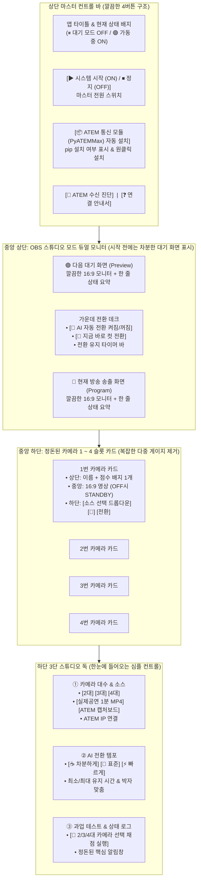

# 원클릭 pip 자동 설치 · 시작 시 대기 모드(Standby OFF) · 깔끔한 OBS 스타일 UI 정돈 계획

## 1. 목표 및 개선 방향 (Goal Description)

사용자분께서 주신 피드백을 바탕으로 다음 3가지 핵심 개선을 진행합니다:

1. **프로그램 내 필수 라이브러리(`PyATEMMax` 등) 상태 점검 및 원클릭 자동 설치 버튼 추가**
   - 실제 ATEM Mini Pro 스위처를 랜선(UDP)으로 제어하기 위해 필요한 `PyATEMMax`를 비롯해 `opencv-python`, `yt-dlp` 등이 설치되어 있는지 프로그램이 스스로 확인합니다.
   - 터미널을 열 필요 없이 상단 바의 **`[📦 필수 모듈(PyATEMMax) 점검 / 자동 설치]`** 버튼을 누르면, 미설치된 패키지를 자동으로 `pip install` 하고 즉시 실제 ATEM 하드웨어 제어 모듈을 활성화합니다.
2. **초기 실행 시 '정지/대기 모드(Standby OFF)' 기본 적용 및 마스터 전원(`ON / OFF`) 버튼 도입**
   - 프로그램을 켜자마자 영상이 돌아가고 수치들이 깜빡여 정신없던 문제를 해결합니다.
   - **기본 상태(`OFF / 대기 모드`)**: 프로그램을 처음 실행하면 **아무런 영상도 재생되지 않는 깔끔한 다크 대기 화면(`STANDBY`)** 상태로 시작합니다.
   - 사용자가 카메라 대수(2~4대)나 연결 방식을 차분히 확인한 뒤 상단의 **`[▶ 시스템 시작 (ON)]`** 버튼을 눌렀을 때만 영상 수신과 AI 자동 스위칭이 작동하며, 언제든 **`[⏹ 시스템 정지 (OFF)]`**를 누르면 모든 영상과 분석이 즉시 멈추고 초기 대기 화면으로 돌아갑니다.
3. **시각적 피로도를 낮춘 미니멀 OBS Studio 레이아웃으로 UI 디자인 대폭 정리**
   - 각 카메라 카드마다 복잡하게 달려 있던 3줄짜리 세부 막대그래프(`구도`, `움직임`, `선명도`)와 긴 설명 문구들을 걷어내고, **핵심 상태 배지 1개(`✨ 85점 베스트` / `⚠️ 흔들림 제외` / `⏸ 대기 중`) + 영상 화면 + 소스 선택 드롭다운**만 남겨 여백과 정돈감을 확보합니다.
   - 하단 패널도 복잡한 슬라이더들을 정리하고 직관적인 3분할 스튜디오 독(**`① 카메라 대수 & 소스`** | **`② 전환 템포 프리셋`** | **`③ 과업 채점 & 한눈에 보는 로그`**)으로 간결하게 다듬습니다.

---

## 2. 정돈된 UI 레이아웃 구조도



---

## 3. 제안 변경 사항 (Proposed Changes)

### Component 1: 필수 `pip` 패키지 점검 및 원클릭 자동 설치기 (`src/utils/dependency_manager.py`)

#### [NEW] [src/utils/dependency_manager.py](file:///c:/Users/ddosu/antigravity_workspace/first/src/utils/dependency_manager.py)
- **`DependencyManager` 클래스 구현**:
  - `check_required_packages()`:
    - `PyATEMMax` (실제 Blackmagic ATEM Mini Pro 하드웨어 이더넷 제어용 필수 라이브러리)
    - `opencv-python` (`cv2`), `numpy`, `PyQt5`, `yt-dlp`
    - 각 패키지의 설치 여부(`installed: bool`)와 버전 정보를 딕셔너리로 즉시 반환합니다.
  - `install_missing_packages(packages)`:
    - 미설치된 패키지(예: `PyATEMMax`)가 있으면 `subprocess.run([sys.executable, "-m", "pip", "install", ...])`를 실행하여 설치하고, 설치 완료 즉시 파이썬 런타임에서 `importlib.invalidate_caches()`를 호출해 프로그램을 껐다 켜지 않아도 바로 실제 ATEM 제어 기능이 활성화되게 합니다.

---

### Component 2: 초기 대기 모드(`STANDBY OFF`) 및 미니멀 OBS 스타일 UI 개편 (`src/desktop_app.py`)

#### [MODIFY] [src/desktop_app.py](file:///c:/Users/ddosu/antigravity_workspace/first/src/desktop_app.py)
1. **초기 실행 시 완전 정지 상태 (`self.system_running = False`)**:
   - 프로그램을 처음 켜면 타이머(`self.timer`)가 작동하지 않으며, 미리보기·방송 화면·카메라 1~4번 화면 모두 **세련된 다크 슬레이트 대기 화면(`STANDBY — 상단의 [▶ 시스템 시작]을 누르면 작동합니다`)**을 그려 정돈된 인상을 줍니다.
   - 상단 중앙의 **`[▶ 시스템 시작 (영상 & AI 켜기)]`** 버튼을 누르면 그때부터 영상 재생 및 AI 분석이 시작되고, 버튼이 **`[⏹ 시스템 정지 (대기 모드로 끄기)]`**로 바뀝니다.
2. **`[📦 필수 모듈(PyATEMMax) 점검/설치]` 버튼 및 자동 설치 팝업**:
   - 상단 바에 현재 `PyATEMMax` 등 필수 `pip` 설치 상태를 직관적으로 표시(`📦 PyATEMMax: 미설치 (클릭하여 자동 설치)` 또는 `✅ 필수 모듈 모두 준비됨`)하고, 클릭 시 원클릭으로 설치를 수행합니다.
3. **복잡한 시각 요소 제거 및 레이아웃 정렬**:
   - 카메라 카드당 3개씩 있던 작은 프로그레스 바(총 12개)를 제거하고, 카메라 헤더 우측의 **단일 종합 상태 배지(`✨ 85점 베스트` / `👌 68점 양호` / `⚠️ 흔들림 제외` / `⏸ 대기 중`)**와 영상 내부의 깔끔한 하단 스코어 바로 통합하여 화면을 훨씬 넓고 정돈되게 만듭니다.

---

## 4. 검증 계획 (Verification Plan)

### Automated Tests
1. **`DependencyManager` 및 `PyATEMMax` 자동 설치 검증**:
   ```powershell
   pytest tests/test_dependency_manager.py -v
   ```
   - 패키지 설치 여부 확인 함수 및 `PyATEMMax` 설치 후 `ATEMController`에서 모듈이 정상 임포트되는지 검증합니다.
2. **전체 단위 테스트 및 `.exe` 재빌드**:
   ```powershell
   pytest tests/test_device_and_verifier.py tests/test_state_machine.py -v
   python scripts/build_exe.py
   ```
