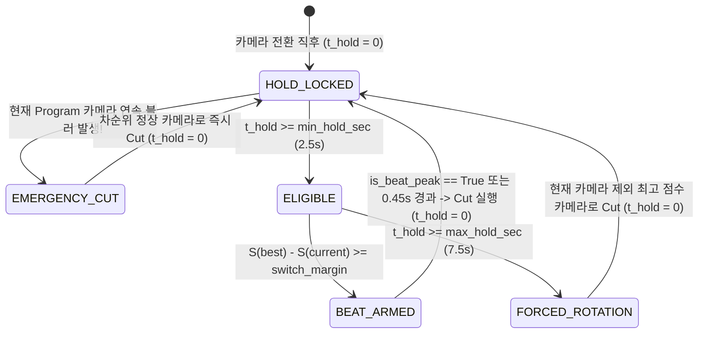

# Spec 03: Broadcast Direction State Machine Specification

## 1. 상태 정의 (Finite State Machine States)

| 상태 이름 | 진입 조건 | 스위칭 동작 |
| :--- | :--- | :--- |
| `HOLD_LOCKED` | 직전 전환 후 경과 시간 $\Delta t < \text{min\_hold\_sec}$ (2.5초) | 전환 금지. 단, 현재 Program 카메라가 연속 3프레임 이상 `is_blurry == True`이면 즉시 `EMERGENCY_CUT` 실행 |
| `ELIGIBLE` | $\text{min\_hold\_sec} \le \Delta t < \text{max\_hold\_sec}$ (7.5초) | 최고 점수 카메라 $c^*$가 현재 카메라 $c_{\text{pgm}}$보다 `switch_margin`(0.10) 이상 높으면 Preview로 지정 후 전환 준비 |
| `BEAT_ARMED` | `ELIGIBLE` 상태에서 전환 대상 $c^*$가 확정되고 `beat_sync_enabled=True`인 경우 | 최대 `0.45초` 동안 오디오 비트 피크(`is_beat_peak=True`)를 대기하다가 비트 도달 즉시 `CUT` 실행 (타임아웃 시 즉시 실행) |
| `FORCED_ROTATION` | $\Delta t \ge \text{max\_hold\_sec}$ (7.5초 초과) | 장기 고정 방지를 위해 **$c_{\text{pgm}}$을 제외한** 정상 카메라($\text{is\_blurry}=\text{False}$) 중 최고 점수 카메라로 강제 전환 |

---

## 2. 상태 전이 다이어그램

